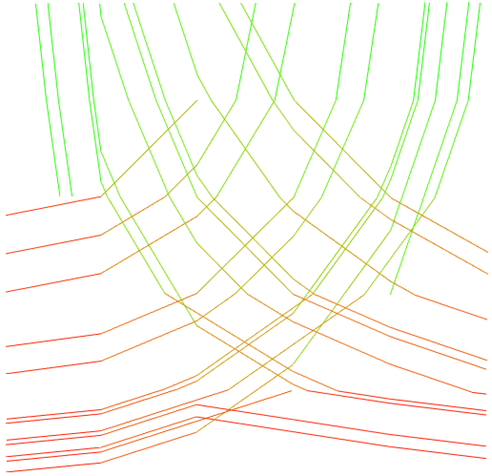

<!-- README.md is generated from README.Rmd. Please edit that file -->

```{r, include = FALSE}
knitr::opts_chunk$set(
  collapse = TRUE,
  comment = "#>",
  fig.path = "man/figures/README-",
  out.width = "100%"
)
```

# dmri.tracking

<!-- badges: start -->
[](https://ci.appveyor.com/project/vic-dragon/dmri.tracking)
<!-- badges: end -->

The goal of dmri.tracking is to apply the deterministic tracking algorithm from DiST [(Wong et al. 2016)](https://projecteuclid.org/journals/annals-of-applied-statistics/volume-10/issue-3/Fiber-direction-estimation-smoothing-and-tracking-in-diffusion-MRI/10.1214/15-AOAS880.full) and to visualize the tracking result.


##### Maintainer: Seungyong Hwang (syhwang@ucdavis.edu)

##### Authors: Raymond Wong, Seungyong Hwang

## Installation

You can install the development version from [GitHub](https://github.com/) with:
``` r
devtools::install_github("vic-dragon/dmri.tracking") 
```
If the above command does not work, try the following command
```r
remotes::install_github("vic-dragon/dmri.tracking@main")
```

## Main Functions

* **v.track()** : Apply the deterministic tracking algorithm -- DiST

* **tractography()** : Plot the tractography based on the result from **v.track()**


## Example
**v.track()** in r package **dmri.tracking** requires a list type of input **v.obj** which has following components:

* **vec:** A matrix containing the estimated peak directions.
* **loc:** A matrix containing the 'braingrid' coordinates of the corresponding estimated peak direction.
* **map:** A vector containing the voxel indicator of corresponding estimated peak direction.
* **rmap:** A vector specifying the location in 'map' of each voxel.
* **n.fiber:** A vector specifying the number of peaks at each voxel.
* **n.fiber2:** A vector specifying the number of peaks corresponding to 'map'.
* **braingrid:** A array specifying the normalized voxel coordinates.
* **xgrid.sp,ygrid.sp,zgrid.sp:** A numeric value specifying the voxel size (mm) in x, y, z-axis, respectively. (e.g. Voxel size in HCP dMRI: 1.25mm * 1.25mm * 1.25mm)

Here, we provide a simple 2D example to construct **v.obj** with 5 by 5 grid.


The data has the directional information as above can be generated by the following code.
```{r eval=FALSE}
n=5  # number of grid for each axis
r=0.6
r_grid = seq(from = 1/(2*n), to = 1-1/(2*n), length.out = n)

r_x=matrix(r_grid, n, n)
r_y=matrix(r_grid, n, n, byrow=T)

# fiber generation schema 1
# set bottom right vertex as center, and draw 1/4 circle with radius 1 and r
# points being selected should satisfy:
# lower edge of its square should be lower than intersection between radius-1 circle and right edge of its square
# i.e., y-0.05<sqrt(1^2-(1-(x+0.05))^2)
# upper edge of its square should be higher than intersection between radius-r circle and left edge of its square
# i.e., y+0.05>sqrt(r^2-(1-(x-0.05))^2)
fib_indi1 = ((1-(r_x+0.05))**2+(r_y-0.05)**2 < 1-1e-6) & ((1-(r_x-0.05))**2+(r_y+0.05)**2 > r**2+1e-6)

# fiber generation schema 2
# set bottom left vertex as center, and draw 1/4 circle with radius 1 and r
# points being selected should satisfy:
# lower edge of its square should be lower than intersection between radius-1 circle and left edge of its square
# i.e., y-0.05<sqrt(1^2-(x-0.05)^2)
# upper edge of its square should be higher than intersection between radius-r circle and right edge of its square
# i.e., y+0.05>sqrt(r^2-(x+0.05)^2)
fib_indi2 = ((r_x-0.05)**2+(r_y-0.05)**2 < 1-1e-6) & ((r_x+0.05)**2+(r_y+0.05)**2 > r**2+1e-6)

# fib_indi[i,j]=0: voxel_ij contains no fibers
# fib_indi[i,j]=1: voxel_ij contains fiber generated from schema 1
# fib_indi[i,j]=2: voxel_ij contains fiber generated from schema 2
# fib_indi[i,j]=3: voxel_ij contains fibers generated from schema 1 and schema 2 (crossing fibers)
# simulation region plot can be obtained by rotating fib_indi 90 degree conter-clockwisely
fib_indi = fib_indi1 + 2*fib_indi2

# Spherical coordinates of fiber directions in each voxel
# coordinate system here is within each voxel, with x-axis perpendicular to the screen, 
# and is different from coordinate system for generating fibers voxelwisely in simulation region
theta_fib_1 = atan2(r_x, 1-r_y) 
theta_fib_2 = (atan2(r_x, r_y)+pi/2 )* fib_indi2

#Cartesian coordinates
dir1_x=cos(theta_fib_1)*sin(pi/2) * fib_indi1
dir1_y=sin(theta_fib_1)*sin(pi/2) * fib_indi1
dir1_z=cos(matrix(pi/2,5,5))* fib_indi1

dir2_x=cos(theta_fib_2)*sin(pi/2) * fib_indi2
dir2_y=sin(theta_fib_2)*sin(pi/2) * fib_indi2
dir2_z=cos(matrix(pi/2,5,5))* fib_indi2
```


With the generated data from the above source code, **v.obj** can be organized as follows: 

```{r eval=FALSE}

# Set voxel size at each axis
xgrid.sp = 1  #the voxel size in x-axis
ygrid.sp = 1  #the voxel size in y-axis
zgrid.sp = 1  #the voxel size in z-axis

# Dimension of the dataset
# Normalize gird coordinates based on the dimension of the dataset and the size of the voxel.
braindim = c(n,n,1)
braingrid = array(dim=c(3,braindim))
for (i in (1:braindim[1])){
  for (j in (1:braindim[2])){
    for (k in (1:braindim[3])){
      braingrid[,i,j,k] <- c((i-braindim[1]/2-.5)*xgrid.sp, (j-braindim[2]/2-.5)*ygrid.sp, (k-braindim[3]/2-.5)*zgrid.sp)
    }
  }
}

# Organize the directions and the locations of the fibers.
# The recording must start from the lower left front corner. (see. ind variable)
vec=NULL
loc=NULL
n.fiber = rep(NA, prod(braindim))
map = c()
for (k in (1:braindim[3])){
  for (j in (1:braindim[2])){
    for (i in (1:braindim[1])){
      ind = ((k-1)*n*n + (j-1)*n +i)
      if(fib_indi[i,j]==3){
        n.fiber[ind] = 2
        vec = rbind(vec,c(dir1_x[i,j],dir1_y[i,j],dir1_z[i,j]))
        loc = rbind(loc,braingrid[,i,j,k])
        map = c(map,ind)
        vec = rbind(vec,c(dir2_x[i,j],dir2_y[i,j],dir2_z[i,j]))
        loc = rbind(loc,braingrid[,i,j,k])
        map = c(map,ind)
      }else if(fib_indi[i,j]==2){
        n.fiber[ind] = 1
        vec = rbind(vec,c(dir2_x[i,j],dir2_y[i,j],dir2_z[i,j]))
        loc = rbind(loc,braingrid[,i,j,k])
        map = c(map,ind)
      }else if(fib_indi[i,j]==1){
        n.fiber[ind] = 1
        vec = rbind(vec,c(dir1_x[i,j],dir1_y[i,j],dir1_z[i,j]))
        loc = rbind(loc,braingrid[,i,j,k])
        map = c(map,ind)
      }else if(fib_indi[i,j]==0){
        n.fiber[ind] = 0
        vec = rbind(vec,c(NA,NA,NA))
        loc = rbind(loc,braingrid[,i,j,k])
        map = c(map,ind)
      }
    }
  }
}

rmap = c()
n.fiber2 = c()
for(i in 1:prod(braindim)){
  rmap = c(rmap, which(map == i)[1])
  n.fiber2 = c(n.fiber2, rep(n.fiber[i],max(n.fiber[i],1)))
}

# To be a input for v.obj function, it should be a list type of variable contain the information with the same name as follows
v.obj = NULL
v.obj$vec = vec
v.obj$loc = loc
v.obj$map = map
v.obj$rmap = rmap
v.obj$n.fiber = n.fiber
v.obj$n.fiber2 = n.fiber2
v.obj$braingrid = braingrid
v.obj$xgrid.sp = xgrid.sp
v.obj$ygrid.sp = ygrid.sp
v.obj$zgrid.sp = zgrid.sp
```

**v.track()** can be fitted with **v.obj** from the above steps.
```{r eval=FALSE}
library(dmri.tracking)
track_result = v.track(v.obj)
```

The output from **v.track()** can be used as an input for **tractography()**
```{r eval=FALSE}
library(rgl)
open3d()
for (iind in (track_result$sorted.iinds[track_result$sorted.update.ind])){
  cat(iind,"\n")
  tractography(track_result$tracks1[[iind]]$inloc, track_result$tracks1[[iind]]$dir)
  tractography(track_result$tracks2[[iind]]$inloc, track_result$tracks2[[iind]]$dir)
}
```

This is the result from the above source code.

